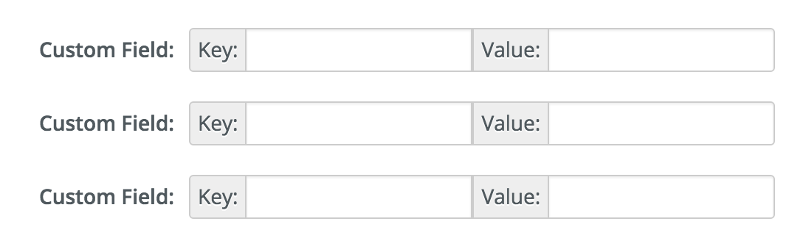

## IFC Demand Data
A repo with processing scripts for datasets that will power the [IFC Demand Tool](https://github.com/developmentseed/ifc-demand-tool).

### Special Instructions

After uploading data to CKAN, there are three custom fields that need to be populated for the data to show up in the tool.



#### `demand-tool-group`

Used to group similar indicators in the tool. String.

#### `demand-tool-type`

*not currently in use; always use `indicator`*

Used to differentiate between indicators (which can be manipulated by the user) or base layer data. Either `indicator` or `base`.

#### `demand-tool-indicator-options`

Provides additional information about how the indicator should be rendered, manipulated, etc. JSON object.

- `geometry.type`: Description of the layer geometry. One of 'fill', 'line', 'circle'.
- `value.type`: Description of how the indicator is edited by the user. One of 'range', 'categorical', 'categorical-unique', 'buffer'.
- `value.range`: Minimum and maximum values. Required if `value.type` is 'range' or 'buffer'. Array of length 2.
- `value.property`: Property name on vector tile layer. Required if `value.type` is 'range' or 'categorical'. String
- `value.stops`: Array of range breakpoints in the data. Used for creating the map layer color scheme and slider scales. Required if `value.type` is 'range'
- `value.format`: Optional string providing additional formatting options. Only current option is `percentage`
- `countries`: Optional array to restrict data layer to loading in certain countries. All countries will attempt to load this layer if this property is not provided. Countries must be provided as lowercase, three character iso codes.

Example:

```js
{
  "geometry": {
    "type": "circle"
  },
  "value": {
    "type": "buffer",
    "range": [1, 100],
    "value": 1
   },
   "countries": ["nga", "tza"]
 }
